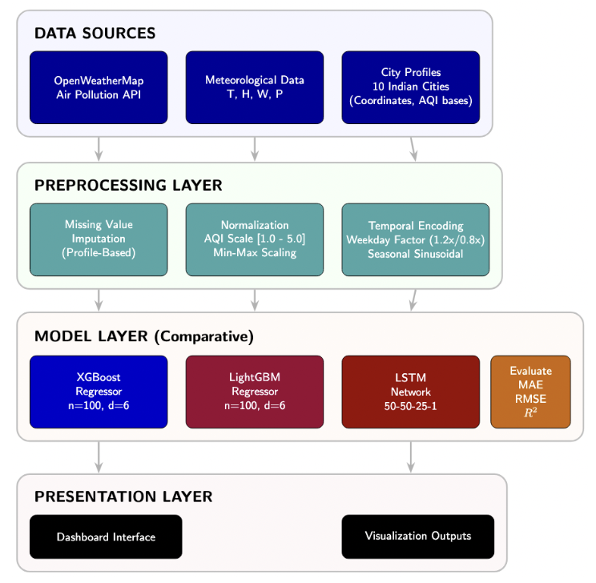
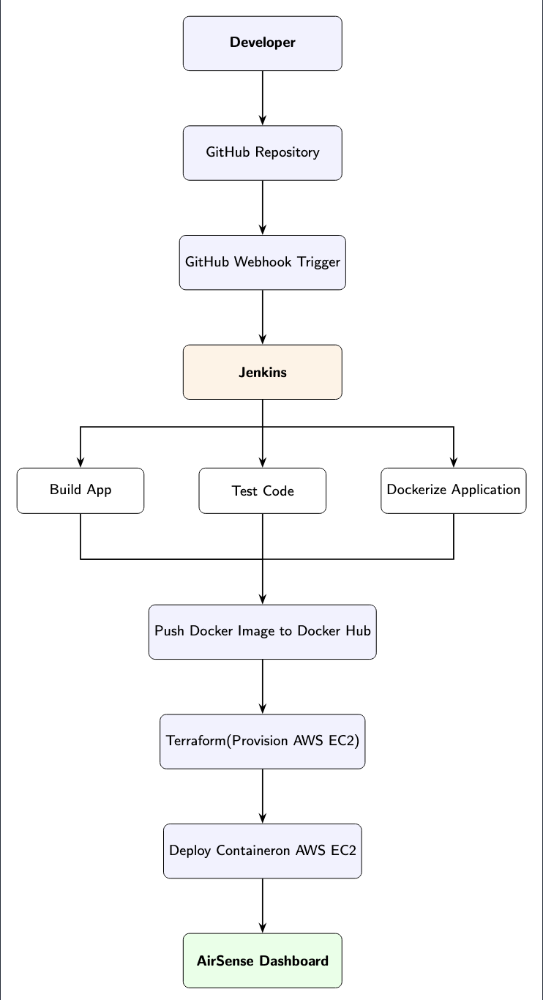

# AirSense: Real-Time AQI Monitoring and Prediction System

**Author**: Mehr Chawla  
**Role**: Technology-focused problem solver | AI and Backend Developer  
**Status**: Portfolio-Ready / Academic Research Prototype  

## Overview
AirSense is a real-time Air Quality Index (AQI) monitoring and short-term prediction system designed to transform raw environmental data into actionable insights. While most systems only display current AQI levels, AirSense extends this functionality by forecasting future values using advanced machine learning and deep learning architectures. By integrating live data from the OpenWeatherMap API with historical pollution patterns, AirSense employs a hybrid modeling approach to generate reliable short-term forecasts, visualized through an intuitive, interactive dashboard.

## Features
* **Real-Time Monitoring**: Live tracking of environmental pollutants and AQI levels.
* **Hybrid ML Architecture**: Utilizes XGBoost and LightGBM for structured data and LSTM for temporal forecasting.
* **Time-Series Forecasting**: Deep learning capabilities to predict future air quality trends.
* **Interactive Dashboard**: Built with Streamlit for seamless data exploration and visualization.
* **Automated DevOps Pipeline**: Fully containerized and deployed via a modern CI/CD workflow.
* **Scalable Backend**: Modular data preprocessing and feature engineering pipelines.

## Tech Stack
| Category | Technologies |
| :--- | :--- |
| Languages | Python |
| Frontend/UI | Streamlit |
| Machine Learning | XGBoost, LightGBM, TensorFlow (LSTM), Scikit-learn |
| APIs & Data | OpenWeatherMap API, Pandas, NumPy |
| DevOps & Infrastructure | Docker, Jenkins, Terraform, AWS EC2, GitHub |

## System Architecture
AirSense follows a modular pipeline designed for scalability, separating data ingestion from the high-performance inference engine.

**Architectural Components:**
* **Data Ingestion**: Fetches real-time environmental and weather metrics via the OpenWeatherMap API.
* **Data Preprocessing**: Handles missing values, feature scaling (Normalization/Standardization), and formatting for sequential processing.
* **ML Prediction Engine**: 
  * **XGBoost and LightGBM**: Handle non-linear relationships in structured environmental features.
  * **LSTM**: A recurrent neural network (RNN) layer that captures temporal dependencies.
* **Visualization Layer**: A Streamlit-based interface that renders current stats and predictive charts.
* **Deployment**: Containerized via Docker and hosted on AWS EC2.



## DevOps and Deployment Pipeline
This project implements a robust CI/CD workflow to ensure automated testing and seamless deployment.

**CI/CD Workflow:**
1. **Version Control**: Developer pushes code to GitHub.
2. **Automation Trigger**: A GitHub Webhook triggers a build job in Jenkins.
3. **Containerization**: Jenkins builds a Docker image containing the application environment.
4. **Registry**: The image is pushed to Docker Hub for versioned storage.
5. **Infrastructure as Code (IaC)**: Terraform provisions and manages the AWS EC2 instance.
6. **Deployment**: The Docker container is automatically pulled and deployed on the EC2 instance.
7. **Access**: The Streamlit app runs live on the public IP.



## Dashboard Preview

### AQI Monitoring Dashboard
Real-time pollutant breakdown and current air quality status.
<p align="center">
  " alt="AQI Monitoring Dashboard" width="800">
</p>

### AQI Prediction View
Visualizing short-term forecasts using the LSTM and Gradient Boosting models.
<p align="center">
  " alt="AQI Prediction View" width="800">
</p>

## Live Deployment
Access the live version of the AirSense dashboard here:
**URL**: `http://http://airsense.viewdns.net/:8501`

## Machine Learning Models
* **XGBoost**: High-performance gradient boosting for handling tabular pollutant data and feature importance ranking.
* **LightGBM**: Optimized for speed and lower memory usage, ensuring the dashboard remains responsive during inference.
* **LSTM (Long Short-Term Memory)**: A deep learning model specifically chosen for its ability to remember long-term dependencies in time-series data, crucial for accurate 24-hour AQI forecasting.

## Project Structure
```plaintext
aqi-dashboard/
├── app.py                      # Main Streamlit application
├── offline_lstm_training.py     # Script for retraining deep learning models
├── generate_revised_diagrams.py # Automation script for system visuals
├── requirements.txt             # Project dependencies
├── Dockerfile                   # Containerization instructions
├── main.tf                      # Terraform infrastructure configuration
├── models/                      # Pre-trained model binaries (.pkl, .h5)
│   ├── xgboost_model.pkl
│   ├── lightgbm_model.pkl
│   └── lstm_model.h5
├── data/                        # Raw and processed datasets
├── utils/                       # Modular helper functions
│   ├── data_preprocessing.py
│   ├── feature_engineering.py
│   └── visualization.py
└── docs/                        # Images and documentation
```

## Installation and Setup

### 1. Clone the Repository
```bash
git clone https://github.com/Mehr-creates/airsense-aqi-prediction-system.git
cd airsense-aqi-prediction-system
```

### 2. Create Virtual Environment
```bash
python -m venv venv
# Mac/Linux: source venv/bin/activate
# Windows: venv\Scripts\activate
```

### 3. Install Dependencies
```bash
pip install -r requirements.txt
```

### 4. Configure API Keys
Create a `.env` file in the root directory:
```env
OPENWEATHER_API_KEY=your_api_key_here
```

### 5. Run Locally
```bash
streamlit run app.py
```

## Results and Performance
The hybrid approach balances the precision of Gradient Boosting with the temporal awareness of Recurrent Neural Networks.
* **Metrics**: Evaluated using RMSE (Root Mean Square Error) and MAE (Mean Absolute Error).
* **Robustness**: Demonstrated stable performance across varying environmental conditions and peak pollution periods.

## Contributing
1. Fork the repository.
2. Create a feature branch (`git checkout -b feature/NewFeature`).
3. Commit changes (`git commit -m 'Add some NewFeature'`).
4. Push to the branch (`git push origin feature/NewFeature`).
5. Submit a Pull Request.

## Support and Contact
**Mehr Chawla**
* **Email**: mehrchawla314@gmail.com
* **GitHub**: [https://github.com/Mehr-creates](https://github.com/Mehr-creates)

## Acknowledgments
This project utilizes open-source libraries and publicly available environmental datasets. Special acknowledgment to the developers of Streamlit, TensorFlow, XGBoost, LightGBM, and OpenWeatherMap API for enabling the development of predictive environmental systems.